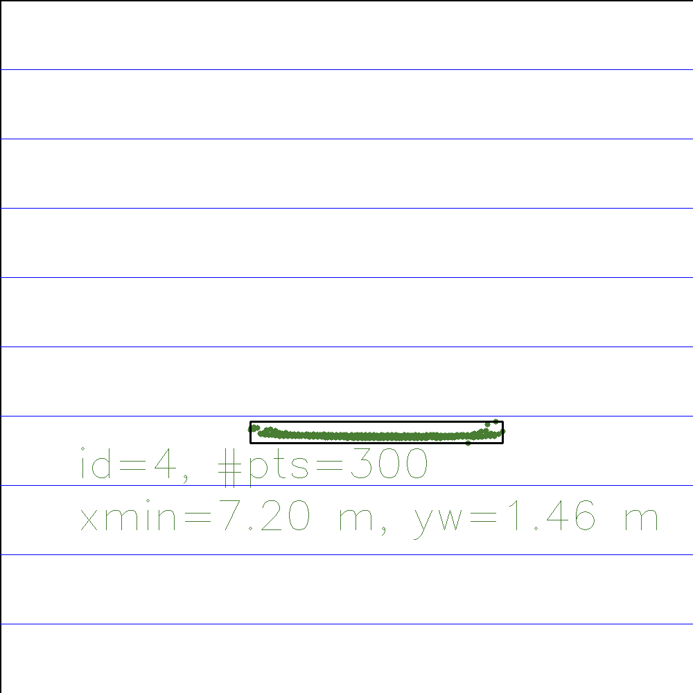
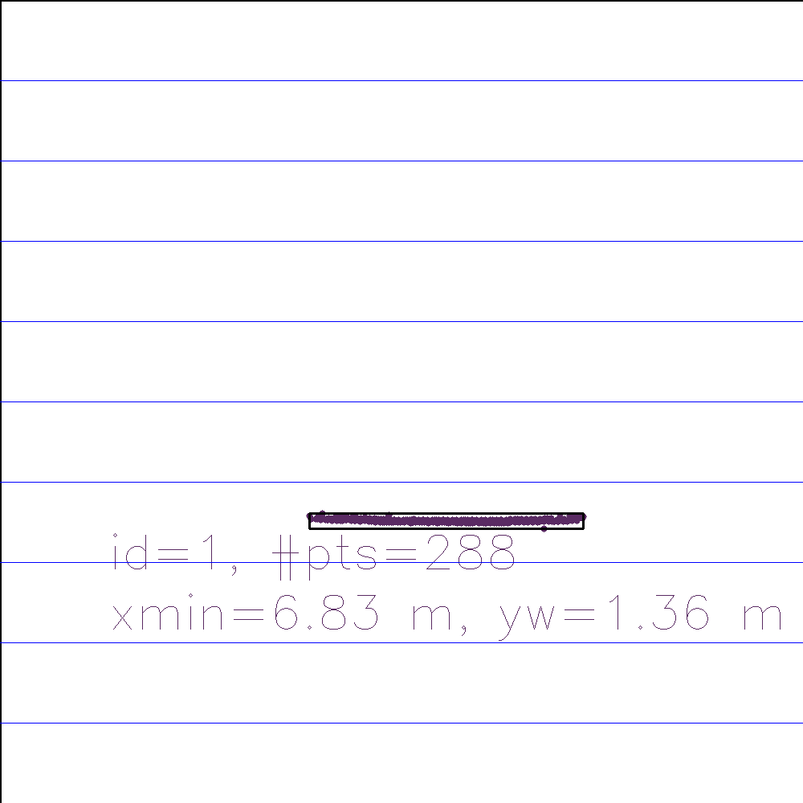
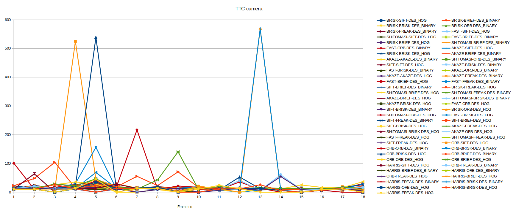
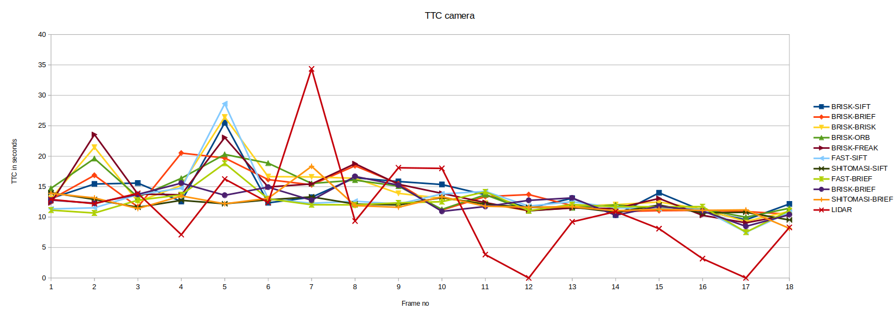

# SFND 3D Object Tracking

Welcome to the final project of the camera course. By completing all the lessons, you now have a solid understanding of keypoint detectors, descriptors, and methods to match them between successive images. Also, you know how to detect objects in an image using the YOLO deep-learning framework. And finally, you know how to associate regions in a camera image with Lidar points in 3D space. Let's take a look at our program schematic to see what we already have accomplished and what's still missing.

In this final project, you will implement the missing parts in the schematic. To do this, you will complete four major tasks: 
1. First, you will develop a way to match 3D objects over time by using keypoint correspondences. 
2. Second, you will compute the TTC based on Lidar measurements. 
3. You will then proceed to do the same using the camera, which requires to first associate keypoint matches to regions of interest and then to compute the TTC based on those matches. 
4. And lastly, you will conduct various tests with the framework. Your goal is to identify the most suitable detector/descriptor combination for TTC estimation and also to search for problems that can lead to faulty measurements by the camera or Lidar sensor. In the last course of this Nanodegree, you will learn about the Kalman filter, which is a great way to combine the two independent TTC measurements into an improved version which is much more reliable than a single sensor alone can be. But before we think about such things, let us focus on your final project in the camera course. 

## Dependencies for Running Locally
* cmake >= 2.8
  * All OSes: [click here for installation instructions](https://cmake.org/install/)
* make >= 4.1 (Linux, Mac), 3.81 (Windows)
  * Linux: make is installed by default on most Linux distros
  * Mac: [install Xcode command line tools to get make](https://developer.apple.com/xcode/features/)
  * Windows: [Click here for installation instructions](http://gnuwin32.sourceforge.net/packages/make.htm)
* Git LFS
  * Weight files are handled using [LFS](https://git-lfs.github.com/)
* OpenCV >= 4.1
  * This must be compiled from source using the `-D OPENCV_ENABLE_NONFREE=ON` cmake flag for testing the SIFT and SURF detectors.
  * The OpenCV 4.1.0 source code can be found [here](https://github.com/opencv/opencv/tree/4.1.0)
* gcc/g++ >= 5.4
  * Linux: gcc / g++ is installed by default on most Linux distros
  * Mac: same deal as make - [install Xcode command line tools](https://developer.apple.com/xcode/features/)
  * Windows: recommend using [MinGW](http://www.mingw.org/)

## Basic Build Instructions

1. Clone this repo.
2. Make a build directory in the top level project directory: `mkdir build && cd build`
3. Compile: `cmake .. && make`
4. Run it: `./3D_object_tracking`.

## Tasks
### FP.0 Final Report
Explained in this Readme file.

### FP.1 Match 3D Objects
Implemented in [src/camFusion_Student.cpp Line 260-305](./src/camFusion_Student.cpp#L260-L305).

### FP.2 Compute Lidar-based TTC
Implemented in [src/camFusion_Student.cpp Line 246-257](./src/camFusion_Student.cpp#L246-L257).

### FP.3 Associate Keypoint Correspondences with Bounding Boxes
Implemented in [src/camFusion_Student.cpp Line 136-149](./src/camFusion_Student.cpp#L136-L149).

### FP.4 Compute Camera-based TTC
Implemented in [src/camFusion_Student.cpp Line 153-210](./src/camFusion_Student.cpp#L153-L210).

### FP.5 Performance Evaluation 1

TTC calculation for each frame is displayed in below table.

| Frame#      | Minimum x distance | Minimum x distance (Manual estimation) | TTC Lidar | TTC Camera |
| -- | ------ | ----- | ------ | ------ |
| 0	 | 7.97m	| 8m		|        |        | 
| 1	 | 7.91m	| 7.9m	| 12.9s	 | 11.1s  | 
| 2	 | 7.85m	| 7.8m	| 12.2s	 | 10.6s  | 
| 3	 | 7.79m	| 7.8m	| 13.9s	 | 12.7s  | 
| 4	 | 7.68m	| 7.7m	| 7.11s	 | 13.6s  | 
| 5	 | 7.64m	| 7.7m	| 16.2s  | 18.8s  | 
| 6	 | 7.58m	| 7.6m	| 12.4s	 | 12.9s  | 
| 7	 | 7.55m	| 7.6m	| 34.34s | 12.02s | 
| 8	 | 7.47m	| 7.5m	|  9.34s | 12s    | 
| 9	 | 7.43m	| 7.5m	| 18.1s	 | 12.3s  | 
| 10 | 7.39m	| 7.4m	| 18.03s | 12.5s  | 
| 11 | 7.2m	  | 7.4m	| 3.83s	 | 14.1s  | 
| 12 | 7.27m	| 7.2m	| NAN	   | 11.05s | 
| 13 | 7.19m	| 7.2m	| 9.22s	 | 12.05s | 
| 14 | 7.13m	| 7.0m	| 10.9s	 | 11.7s  | 
| 15 | 7.04m	| 7.0m	| 8.09s	 | 11.7s  | 
| 16 | 6.83m	| 7.0m	| 3.17s	 | 11.7s  | 
| 17 | 6.9m	  | 6.8m	| NAN	   | 7.5s   | 
| 18 | 6.81m	| 6.8m	| 8.3s	 | 11s    | 

For Frame 11 and 16 Lidar based TTC computation seems to be wrong and quite different from Camera based calculation.

For Frame 11, Lidar based TTC is 3.83s compared to 14.1s computed from camera image.

If we look at top view of Lidar data, there seems to be an outlier that was not removed during clustering Lidar points. Thus when distance to the rear of the preceding vehicle seems to be around 7.4m(manual estimation), it is calculated around 7.2m due to outlier and resulting much shorter TTC time.

For Frame 16, Lidar based TTC is 3.17s compared to 11.7s computed from camera image.

If we look at top view of Lidar data, similar to frame 11, there seems to be an outlier that was not removed during clustering Lidar points. Thus when distance to the rear of the preceding vehicle seems to be around 7m(manual estimation), it is calculated around 6.8m due to outlier and resulting much shorter TTC time.

### FP.6 Performance Evaluation 2

Different feature detector/descriptor combinations result different TTC calculation based on camera. All possible combination was executed and result was saved in [performance.csv](performance.csv) file.

Below graph displays TTC calculated for all detector/descriptor combinations.

It looks like many of the detector/descriptor combinations calculated TTC wrong due to finding too few matches or wrong matches. 
Observing the data, it seems when detector/descriptor combination find more feature matches, camera based TTC calculation is more robust. 

Thus Feature detector/descriptor combinations were ranked by feaure matches and top 10 combinations with most matches were:
 - BRISK-SIFT
 - BRISK-BRIEF
 - BRISK-BRISK
 - BRISK-ORB
 - BRISK-FREAK
 - FAST-SIFT
 - SHITOMASI-SIFT
 - FAST-BRIEF
 - BRISK-BRIEF
 - SHITOMASI-BRIEF

Below graph displays TTC calculated for each frame using those 10 detector/descriptor combinations.

Based on above graph, all of the top 10 detector/descriptor combination is much robust compared to Lidar based TTC calculation(drawn in red). 